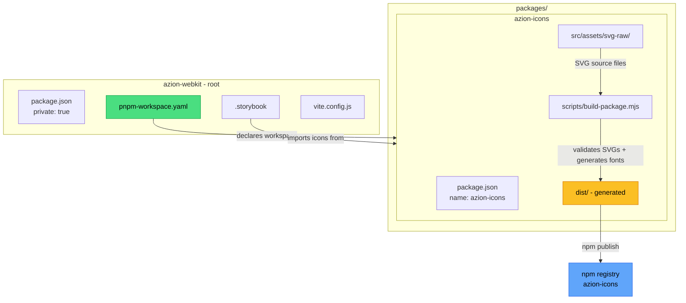

# Plan: Make `azion-icons` Publishable to npm and Accessible via pnpm Workspace

## Current State Analysis

### Repository Structure
The repo `azion-webkit` is a Vue.js + Tailwind CSS component library with a `packages/` directory containing **one** sub-package: [`azion-icons`](packages/azion-icons/package.json). However, the repo is **not** configured as a pnpm workspace — there is no `pnpm-workspace.yaml` file and the root [`package.json`](package.json) has no `workspaces` field.

### Key Issues Found

| # | Issue | Location | Impact |
|---|-------|----------|--------|
| 1 | **No `pnpm-workspace.yaml`** | Root | pnpm does not recognize `packages/*` as workspace members; `azion-icons` cannot be referenced from root |
| 2 | **`"private": true`** in azion-icons | [`packages/azion-icons/package.json:4`](packages/azion-icons/package.json:4) | npm will refuse to publish the package |
| 3 | **Unscoped name `azion-icons`** | [`packages/azion-icons/package.json:2`](packages/azion-icons/package.json:2) | Risk of name collision on npm; consider scoping to `@azion/icons` or keeping `azion-icons` if the org owns it |
| 4 | **No `packageManager` field** in root | [`package.json`](package.json) | Corepack cannot enforce the correct pnpm version |
| 5 | **No workspace-level build/validate scripts** in root | [`package.json:19`](package.json:19) | Root can only run storybook; no way to build or validate icons from root |
| 6 | **Storybook imports `primeicons` directly** | [`.storybook/preview.js:7`](.storybook/preview.js:7) | Should import from `azion-icons` workspace package instead |
| 7 | **`build-package.mjs` generates dist/package.json** | [`packages/azion-icons/scripts/build-package.mjs:83`](packages/azion-icons/scripts/build-package.mjs:83) | The generated dist/package.json reads `name` and `version` from the local `package.json` — works correctly, but `"private": true` must be removed from source for the workflow to make sense |
| 8 | **Missing `repository` field pointing to monorepo** | [`packages/azion-icons/package.json`](packages/azion-icons/package.json) | npm page won't link back to the correct repo/directory |
| 9 | **`azion-icons` uses `vue-cli-service`** for dev/build | [`packages/azion-icons/package.json:8`](packages/azion-icons/package.json:8) | The demo app uses vue-cli, which is fine for the dev preview but separate from the npm build pipeline (`build:package`) |

---

## Proposed Changes

### 1. Create `pnpm-workspace.yaml`

**File:** `pnpm-workspace.yaml` (new, at root)

```yaml
packages:
  - "packages/*"
```

This enables pnpm to recognize `packages/azion-icons` as a workspace member, allowing other packages and the root to reference it via `workspace:*`.

---

### 2. Update Root `package.json`

**File:** [`package.json`](package.json)

Changes:

```jsonc
{
  "name": "azion-webkit",
  "private": true,          // ADD — root should never be published
  "packageManager": "pnpm@9.15.0",  // ADD — pin pnpm version via corepack
  "scripts": {
    "storybook": "storybook dev -p 6006",
    "build:storybook": "storybook build",
    // ADD workspace-level scripts for azion-icons:
    "icons:build": "pnpm --filter azion-icons run build:package",
    "icons:validate": "pnpm --filter azion-icons run validate",
    "icons:publish": "pnpm --filter azion-icons run publish:package"
  },
  // ... rest stays the same
}
```

> **Note:** The exact pnpm version in `packageManager` should match the version currently being used. Check with `pnpm --version`.

---

### 3. Update `packages/azion-icons/package.json`

**File:** [`packages/azion-icons/package.json`](packages/azion-icons/package.json)

Changes:

```jsonc
{
  "name": "azion-icons",          // KEEP as-is (or scope to @azion/icons if desired)
  // "private": true,             // REMOVE — this blocks npm publish
  "version": "0.1.0",
  "description": "Azion icon font library — azionicons + primeicons as CSS/woff2",
  "license": "MIT",
  "repository": {
    "type": "git",
    "url": "https://github.com/aziontech/azion-webkit.git",  // UPDATE — point to monorepo
    "directory": "packages/azion-icons"                        // ADD — npm shows link to correct dir
  },
  "publishConfig": {
    "access": "public"             // ADD — ensure public publish (needed for scoped names)
  },
  // scripts and deps remain unchanged
}
```

---

### 4. Review `build-package.mjs` dist/package.json Generation

**File:** [`packages/azion-icons/scripts/build-package.mjs`](packages/azion-icons/scripts/build-package.mjs)

The script at [line 82-100](packages/azion-icons/scripts/build-package.mjs:82) generates a standalone `dist/package.json` for npm publish. It reads `name`, `version`, `description`, and `license` from the local `package.json`. This is correct and well-structured.

**No code changes required**, but after removing `"private": true` the workflow becomes:

```
node scripts/build-package.mjs   →  generates dist/ with package.json, CSS, woff2, LICENSE, README
cd dist && npm pack --dry-run     →  preview the tarball
cd dist && npm publish            →  publish to npm
```

---

### 5. Update Storybook to Use Workspace `azion-icons`

**File:** [`.storybook/preview.js`](.storybook/preview.js)

Currently imports:
```js
import 'primeicons/primeicons.css'  // line 7
```

Should import from the workspace package instead:
```js
import 'azion-icons'  // imports index.css which includes both azionicons + primeicons
```

**However**, this requires `azion-icons` to be built first (`dist/` must exist with the CSS + woff2 files). An alternative is to keep importing the raw CSS files directly from the workspace source:

```js
import 'azion-icons/src/assets/icon-fonts/azionicons.css'
import 'azion-icons/src/assets/icon-fonts/primeicons.css'
```

This approach works during dev without needing a build step. The decision depends on your workflow preference.

---

## Architecture Diagram



---

## Summary of Files to Create/Modify

| Action | File | Description |
|--------|------|-------------|
| **CREATE** | `pnpm-workspace.yaml` | Enable pnpm workspaces with `packages/*` |
| **MODIFY** | [`package.json`](package.json) | Add `private: true`, `packageManager`, workspace scripts |
| **MODIFY** | [`packages/azion-icons/package.json`](packages/azion-icons/package.json) | Remove `private: true`, update `repository`, add `publishConfig` |
| **MODIFY** | [`.storybook/preview.js`](.storybook/preview.js) | Import icons from workspace package |

---

## Publishing Workflow

After implementing the changes:

1. `pnpm install` — links workspace packages
2. `pnpm icons:build` — runs the build pipeline from root
3. `pnpm icons:publish` — publishes from `packages/azion-icons/dist/`

Or from within the package directory:
1. `cd packages/azion-icons`
2. `npm run build:package`
3. `npm run publish:package`
