# Form Inputs Migration Plan

## Overview

This document outlines the migration plan for moving 24 Vue components from `packages/webkit/src/form-inputs/` to `packages/webkit/src/core/` following the established pattern in the webkit package.

## Current Structure

### Source Location
```
packages/webkit/src/form-inputs/
├── fieldAutoComplete.vue
├── fieldCheckboxBlock.vue
├── fieldDropdown.vue
├── fieldDropdownIcon.vue
├── fieldDropdownLazyLoader.vue
├── fieldDropdownLazyLoaderDinaminc.vue
├── fieldDropdownLazyLoaderWithFilter.vue
├── fieldDropdownMultiSelectLazyLoader.vue
├── fieldGroupCheckbox.vue
├── fieldGroupRadio.vue
├── fieldGroupSwitch.vue
├── fieldInputGroup.vue
├── fieldMultiSelect.vue
├── fieldNumber.vue
├── fieldPhoneNumber.vue
├── fieldPhoneNumberCountry.vue
├── fieldPickList.vue
├── fieldRadioBlock.vue
├── fieldSwitch.vue
├── fieldSwitchBlock.vue
├── fieldText.vue
├── fieldTextArea.vue
├── fieldTextIcon.vue
└── fieldTextPassword.vue
```

### Target Structure Pattern
Based on existing components in `packages/webkit/src/core/`:

```
packages/webkit/src/core/
├── input-text/
│   ├── input-text.vue
│   ├── input-text.vue.d.ts
│   ├── input-text.vue.d.ts.map
│   └── package.json
├── label/
│   ├── label.vue
│   ├── label.vue.d.ts
│   ├── label.vue.d.ts.map
│   └── package.json
└── selector-block/
    ├── selector-block.vue
    ├── selector-block.vue.d.ts
    ├── selector-block.vue.d.ts.map
    └── package.json
```

## Migration Rules

### 1. File Naming Convention
- Convert from **PascalCase** to **kebab-case**
- Example: `fieldAutoComplete.vue` → `field-auto-complete/field-auto-complete.vue`

### 2. Import Path Replacements

| Old Import | New Import |
|------------|------------|
| `import LabelBlock from '@/templates/label-block'` | `import LabelBlock from '../label'` |
| `import SelectorBlock from '@/templates/selector-block'` | `import SelectorBlock from '../selector-block'` |

### 3. Internal Component Dependencies
Components that import other form-input components will need updated relative paths:

| Component | Depends On | New Import Path |
|-----------|------------|-----------------|
| `fieldGroupCheckbox.vue` | `FieldCheckboxBlock` | `../field-checkbox-block` |
| `fieldGroupRadio.vue` | `FieldRadioBlock` | `../field-radio-block` |
| `fieldGroupSwitch.vue` | `FieldSwitchBlock` | `../field-switch-block` |
| `fieldPhoneNumberCountry.vue` | `FieldPhoneNumber` | `../field-phone-number` |

## Migration Order

Components must be migrated in dependency order to avoid broken imports:

### Phase 1 - Independent Components (No Internal Dependencies)
These components only depend on external libraries or already-migrated core components:

1. `fieldAutoComplete.vue` → `field-auto-complete/`
2. `fieldDropdown.vue` → `field-dropdown/`
3. `fieldDropdownIcon.vue` → `field-dropdown-icon/`
4. `fieldDropdownLazyLoader.vue` → `field-dropdown-lazy-loader/`
5. `fieldDropdownLazyLoaderDinaminc.vue` → `field-dropdown-lazy-loader-dynamic/`
6. `fieldDropdownLazyLoaderWithFilter.vue` → `field-dropdown-lazy-loader-with-filter/`
7. `fieldDropdownMultiSelectLazyLoader.vue` → `field-dropdown-multi-select-lazy-loader/`
8. `fieldInputGroup.vue` → `field-input-group/`
9. `fieldMultiSelect.vue` → `field-multi-select/`
10. `fieldNumber.vue` → `field-number/`
11. `fieldPhoneNumber.vue` → `field-phone-number/`
12. `fieldPickList.vue` → `field-pick-list/`
13. `fieldSwitch.vue` → `field-switch/`
14. `fieldText.vue` → `field-text/`
15. `fieldTextArea.vue` → `field-text-area/`
16. `fieldTextIcon.vue` → `field-text-icon/`
17. `fieldTextPassword.vue` → `field-text-password/`

### Phase 2 - Selector Block Components
These depend on `SelectorBlock` (already migrated to core):

18. `fieldCheckboxBlock.vue` → `field-checkbox-block/`
19. `fieldRadioBlock.vue` → `field-radio-block/`
20. `fieldSwitchBlock.vue` → `field-switch-block/`

### Phase 3 - Group Components
These depend on Phase 2 components:

21. `fieldGroupCheckbox.vue` → `field-group-checkbox/`
22. `fieldGroupRadio.vue` → `field-group-radio/`
23. `fieldGroupSwitch.vue` → `field-group-switch/`

### Phase 4 - Dependent Components
24. `fieldPhoneNumberCountry.vue` → `field-phone-number-country/` (depends on `field-phone-number`)

## File Mapping Summary

| Original File | New Directory | New Vue File Name |
|---------------|---------------|-------------------|
| `fieldAutoComplete.vue` | `field-auto-complete/` | `field-auto-complete.vue` |
| `fieldCheckboxBlock.vue` | `field-checkbox-block/` | `field-checkbox-block.vue` |
| `fieldDropdown.vue` | `field-dropdown/` | `field-dropdown.vue` |
| `fieldDropdownIcon.vue` | `field-dropdown-icon/` | `field-dropdown-icon.vue` |
| `fieldDropdownLazyLoader.vue` | `field-dropdown-lazy-loader/` | `field-dropdown-lazy-loader.vue` |
| `fieldDropdownLazyLoaderDinaminc.vue` | `field-dropdown-lazy-loader-dynamic/` | `field-dropdown-lazy-loader-dynamic.vue` |
| `fieldDropdownLazyLoaderWithFilter.vue` | `field-dropdown-lazy-loader-with-filter/` | `field-dropdown-lazy-loader-with-filter.vue` |
| `fieldDropdownMultiSelectLazyLoader.vue` | `field-dropdown-multi-select-lazy-loader/` | `field-dropdown-multi-select-lazy-loader.vue` |
| `fieldGroupCheckbox.vue` | `field-group-checkbox/` | `field-group-checkbox.vue` |
| `fieldGroupRadio.vue` | `field-group-radio/` | `field-group-radio.vue` |
| `fieldGroupSwitch.vue` | `field-group-switch/` | `field-group-switch.vue` |
| `fieldInputGroup.vue` | `field-input-group/` | `field-input-group.vue` |
| `fieldMultiSelect.vue` | `field-multi-select/` | `field-multi-select.vue` |
| `fieldNumber.vue` | `field-number/` | `field-number.vue` |
| `fieldPhoneNumber.vue` | `field-phone-number/` | `field-phone-number.vue` |
| `fieldPhoneNumberCountry.vue` | `field-phone-number-country/` | `field-phone-number-country.vue` |
| `fieldPickList.vue` | `field-pick-list/` | `field-pick-list.vue` |
| `fieldRadioBlock.vue` | `field-radio-block/` | `field-radio-block.vue` |
| `fieldSwitch.vue` | `field-switch/` | `field-switch.vue` |
| `fieldSwitchBlock.vue` | `field-switch-block/` | `field-switch-block.vue` |
| `fieldText.vue` | `field-text/` | `field-text.vue` |
| `fieldTextArea.vue` | `field-text-area/` | `field-text-area.vue` |
| `fieldTextIcon.vue` | `field-text-icon/` | `field-text-icon.vue` |
| `fieldTextPassword.vue` | `field-text-password/` | `field-text-password.vue` |

## Package.json Template

Each component directory needs a `package.json` file:

```json
{
  "main": "./{component-name}.vue",
  "module": "./{component-name}.vue",
  "types": "./{component-name}.vue.d.ts",
  "browser": {
    "./sfc": "./{component-name}.vue"
  },
  "sideEffects": [
    "*.vue"
  ]
}
```

## Import Changes by Component

### Components Using LabelBlock
The following components import `LabelBlock` and need the import path updated:

- `fieldDropdown.vue`
- `fieldDropdownLazyLoader.vue`
- `fieldDropdownLazyLoaderDinaminc.vue`
- `fieldDropdownLazyLoaderWithFilter.vue`
- `fieldDropdownMultiSelectLazyLoader.vue`
- `fieldInputGroup.vue`
- `fieldMultiSelect.vue`
- `fieldNumber.vue`
- `fieldPhoneNumber.vue`
- `fieldText.vue`
- `fieldTextArea.vue`
- `fieldTextIcon.vue`
- `fieldTextPassword.vue`

**Change:** `import LabelBlock from '@/templates/label-block'` → `import LabelBlock from '../label'`

### Components Using SelectorBlock
The following components import `SelectorBlock`:

- `fieldCheckboxBlock.vue`
- `fieldRadioBlock.vue`
- `fieldSwitchBlock.vue`

**Change:** `import SelectorBlock from '@/templates/selector-block'` → `import SelectorBlock from '../selector-block'`

### Components Using Other Form Inputs
| Component | Old Import | New Import |
|-----------|------------|------------|
| `fieldGroupCheckbox.vue` | `import FieldCheckboxBlock from '@/templates/form-fields-inputs/fieldCheckboxBlock'` | `import FieldCheckboxBlock from '../field-checkbox-block'` |
| `fieldGroupRadio.vue` | `import FieldRadioBlock from '@/templates/form-fields-inputs/fieldRadioBlock'` | `import FieldRadioBlock from '../field-radio-block'` |
| `fieldGroupSwitch.vue` | `import FieldSwitchBlock from '@/templates/form-fields-inputs/fieldSwitchBlock'` | `import FieldSwitchBlock from '../field-switch-block'` |
| `fieldPhoneNumberCountry.vue` | `import FieldPhoneNumber from '@/templates/form-fields-inputs/fieldPhoneNumber'` | `import FieldPhoneNumber from '../field-phone-number'` |

## Post-Migration Tasks

1. **TypeScript Declarations**: Generate `.d.ts` and `.d.ts.map` files for each component
2. **Index Exports**: Update any barrel exports/index files
3. **Testing**: Verify all imports resolve correctly
4. **Cleanup**: Remove or deprecate the original `form-inputs` folder

## Migration Flow Diagram

```mermaid
flowchart TD
    subgraph Already Migrated
        L[label/]
        IT[input-text/]
        SB[selector-block/]
    end

    subgraph Phase 1 - Independent Components
        FA[field-auto-complete/]
        FD[field-dropdown/]
        FDI[field-dropdown-icon/]
        FDLL[field-dropdown-lazy-loader/]
        FDLLD[field-dropdown-lazy-loader-dynamic/]
        FDLLWF[field-dropdown-lazy-loader-with-filter/]
        FDMSLL[field-dropdown-multi-select-lazy-loader/]
        FIG[field-input-group/]
        FMS[field-multi-select/]
        FN[field-number/]
        FPN[field-phone-number/]
        FPL[field-pick-list/]
        FS[field-switch/]
        FT[field-text/]
        FTA[field-text-area/]
        FTI[field-text-icon/]
        FTP[field-text-password/]
    end

    subgraph Phase 2 - Selector Block Components
        FCB[field-checkbox-block/]
        FRB[field-radio-block/]
        FSB[field-switch-block/]
    end

    subgraph Phase 3 - Group Components
        FGC[field-group-checkbox/]
        FGR[field-group-radio/]
        FGS[field-group-switch/]
    end

    subgraph Phase 4 - Dependent Components
        FPNC[field-phone-number-country/]
    end

    %% Phase 1 dependencies
    FA --> L
    FD --> L
    FDLL --> L
    FDLLD --> L
    FDLLWF --> L
    FDMSLL --> L
    FIG --> L
    FMS --> L
    FN --> L
    FPN --> L
    FT --> L
    FTA --> L
    FTI --> L
    FTP --> L

    %% Phase 2 dependencies
    FCB --> SB
    FRB --> SB
    FSB --> SB

    %% Phase 3 dependencies
    FGC --> FCB
    FGR --> FRB
    FGS --> FSB

    %% Phase 4 dependencies
    FPNC --> FPN
```



## Estimated Scope

- **Total Components**: 24
- **Phase 1**: 17 components
- **Phase 2**: 3 components
- **Phase 3**: 3 components
- **Phase 4**: 1 component

## Migration Status

**COMPLETED** - All 24 components have been successfully migrated to `packages/webkit/src/core/`.

### Migrated Components Summary

| Component | Status | Location |
|-----------|--------|----------|
| field-auto-complete | ✅ | core/field-auto-complete/ |
| field-checkbox-block | ✅ | core/field-checkbox-block/ |
| field-dropdown | ✅ | core/field-dropdown/ |
| field-dropdown-icon | ✅ | core/field-dropdown-icon/ |
| field-dropdown-lazy-loader | ✅ | core/field-dropdown-lazy-loader/ |
| field-dropdown-lazy-loader-dynamic | ✅ | core/field-dropdown-lazy-loader-dynamic/ |
| field-dropdown-lazy-loader-with-filter | ✅ | core/field-dropdown-lazy-loader-with-filter/ |
| field-dropdown-multi-select-lazy-loader | ✅ | core/field-dropdown-multi-select-lazy-loader/ |
| field-group-checkbox | ✅ | core/field-group-checkbox/ |
| field-group-radio | ✅ | core/field-group-radio/ |
| field-group-switch | ✅ | core/field-group-switch/ |
| field-input-group | ✅ | core/field-input-group/ |
| field-multi-select | ✅ | core/field-multi-select/ |
| field-number | ✅ | core/field-number/ |
| field-phone-number | ✅ | core/field-phone-number/ |
| field-phone-number-country | ✅ | core/field-phone-number-country/ |
| field-pick-list | ✅ | core/field-pick-list/ |
| field-radio-block | ✅ | core/field-radio-block/ |
| field-switch | ✅ | core/field-switch/ |
| field-switch-block | ✅ | core/field-switch-block/ |
| field-text | ✅ | core/field-text/ |
| field-text-area | ✅ | core/field-text-area/ |
| field-text-icon | ✅ | core/field-text-icon/ |
| field-text-password | ✅ | core/field-text-password/ |

### Remaining Tasks

1. **TypeScript Declarations**: Generate `.d.ts` and `.d.ts.map` files for the newly migrated components
2. **Cleanup**: Remove or deprecate the original `form-inputs` folder after updating any external consumers
