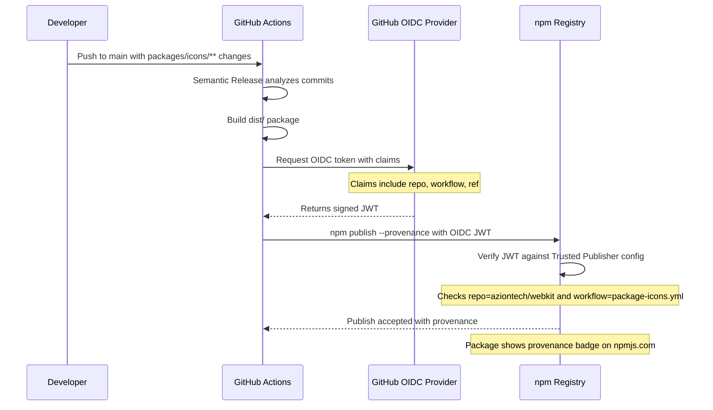

# Plan: Implement NPM Trusted Publishers for @aziontech/icons

## Background

NPM Trusted Publishers uses OpenID Connect (OIDC) to let GitHub Actions publish packages to npm **without storing a long-lived npm token**. Instead of the current `PKG_NPM_TOKEN` secret, the npm registry verifies the publish request came from a trusted GitHub Actions workflow via OIDC identity federation.

### Benefits
- **No token management** — no secrets to rotate or risk leaking
- **Provenance attestation** — published packages get a cryptographic provenance badge on npmjs.com, showing which repo/commit/workflow built them
- **Granular trust** — publish rights are scoped to a specific repository, workflow file, and optionally environment

---

## Current State

| Component | Current Configuration |
|---|---|
| Workflow | [`.github/workflows/package-icons.yml`](.github/workflows/package-icons.yml) — uses `secrets.PKG_NPM_TOKEN` |
| Release config | [`packages/icons/.releaserc`](packages/icons/.releaserc) — `@semantic-release/npm` with `pkgRoot: dist` |
| Permissions | Already has `id-token: write` in the workflow |
| Node/npm | Alpine 3.18 with Node 20 LTS |
| Package | `@aziontech/icons` with `publishConfig.access: public` |

---

## Implementation Steps

### 1. Configure Trusted Publisher on npmjs.com (Manual — Required First)

This must be done by an npm org admin for `@aziontech` **before** any code changes:

1. Go to https://www.npmjs.com/package/@aziontech/icons/access
2. Under **Publishing access** → click **Add trusted publisher**
3. Fill in the Trusted Publisher form:
   - **Repository owner:** `aziontech`
   - **Repository name:** `webkit`
   - **Workflow filename:** `package-icons.yml`
   - **Environment:** *(leave blank unless using GitHub Environments)*
4. Save the configuration

> **Important:** The workflow filename must match exactly — `package-icons.yml`, not the full path.

### 2. Update GitHub Actions Workflow

**File:** `.github/workflows/package-icons.yml`

Changes needed:

```yaml
name: Publish @aziontech/icons to NPM

on:
  push:
    branches:
      - main
    paths:
      - 'packages/icons/**'

jobs:
  release:
    name: Semantic Release
    runs-on: ubuntu-latest
    # REMOVED: container image — use native runner for better OIDC support
    
    permissions:
      contents: write
      issues: write
      pull-requests: write
      id-token: write  # Required for OIDC / Trusted Publishers

    steps:
      - name: Checkout
        uses: actions/checkout@v4
        with:
          fetch-depth: 0
          token: ${{ secrets.GIT_PKG }}

      - name: Setup Node.js
        uses: actions/setup-node@v4
        with:
          node-version: 'lts/*'
          registry-url: 'https://registry.npmjs.org'  # Required for OIDC auth

      - name: Setup pnpm
        uses: pnpm/action-setup@v4
        with:
          version: 9

      - name: Install workspace dependencies
        run: pnpm install --frozen-lockfile

      - name: Run Semantic Release
        working-directory: packages/icons
        run: npx semantic-release
        env:
          GITHUB_TOKEN: ${{ secrets.GIT_PKG }}
          # NPM_TOKEN is no longer needed — OIDC handles auth
```

Key changes:
- **Remove the Alpine container** — OIDC token exchange works natively on `ubuntu-latest` runners. The Alpine container complicates OIDC because `actions/setup-node` sets up the auth config on the runner, not inside the container.
- **Add `registry-url`** to `actions/setup-node@v4` — this is required for the OIDC token exchange to work; it configures `.npmrc` with the registry URL and auth placeholder.
- **Remove `NPM_TOKEN`** environment variable — the OIDC-based auth replaces it entirely.
- **Remove `apk add git curl bash`** step — no longer needed since we are on `ubuntu-latest`.

### 3. Update `.releaserc` — Enable Provenance

**File:** `packages/icons/.releaserc`

Update the `@semantic-release/npm` plugin configuration to pass `--provenance`:

```json
[
  "@semantic-release/npm",
  {
    "pkgRoot": "dist",
    "npmPublish": true
  }
]
```

Then set the npm provenance flag via environment in the workflow:

```yaml
env:
  GITHUB_TOKEN: ${{ secrets.GIT_PKG }}
  NPM_CONFIG_PROVENANCE: true
```

> **Why `NPM_CONFIG_PROVENANCE` env var?** `@semantic-release/npm` does not have a native `provenance` option. Setting `NPM_CONFIG_PROVENANCE=true` tells the underlying `npm publish` command to include provenance attestation. This is the recommended approach.

### 4. Ensure `dist/package.json` Has Required Fields

**File:** `packages/icons/scripts/build-package.mjs`

The generated `dist/package.json` needs a [`repository`](packages/icons/scripts/build-package.mjs:97) field for provenance to work. It currently has one pointing to the old repo URL. Update it to match the actual repo:

```javascript
repository: {
  type: "git",
  url: "https://github.com/aziontech/webkit.git",
  directory: "packages/icons"
},
```

Also ensure `publishConfig` with `access: public` is present in the dist package.json, since scoped packages default to restricted:

```javascript
publishConfig: {
  access: "public"
},
```

---

## Architecture Flow



---

## Files to Modify

| File | Change |
|---|---|
| `.github/workflows/package-icons.yml` | Remove container, add registry-url, remove NPM_TOKEN, add NPM_CONFIG_PROVENANCE |
| `packages/icons/.releaserc` | No changes needed for the plugin config itself |
| `packages/icons/scripts/build-package.mjs` | Fix repository URL, add publishConfig.access |

---

## Post-Implementation Verification

1. After merging, the first publish will appear on npmjs.com with a **provenance badge**
2. Verify at `https://www.npmjs.com/package/@aziontech/icons` — look for the green checkmark and provenance info
3. The `PKG_NPM_TOKEN` secret can be removed from the repo settings after confirming the Trusted Publisher flow works

---

## Rollback Plan

If the Trusted Publisher publish fails:
1. Re-add `NPM_TOKEN: ${{ secrets.PKG_NPM_TOKEN }}` to the workflow env
2. The Trusted Publisher config on npmjs.com can coexist with token-based auth, so there is no conflict

---

## Important Notes

- **The npm org admin must configure the Trusted Publisher on npmjs.com BEFORE the workflow runs without a token.** Otherwise, the publish will fail with a 403.
- **`@semantic-release/npm` v11+** works fine with OIDC — it delegates to `npm publish` which handles the token exchange.
- **Provenance requires npm >= 9.5.0** which is included with Node 20 LTS.
- **The `id-token: write` permission** is already present in the current workflow, which is a prerequisite.
